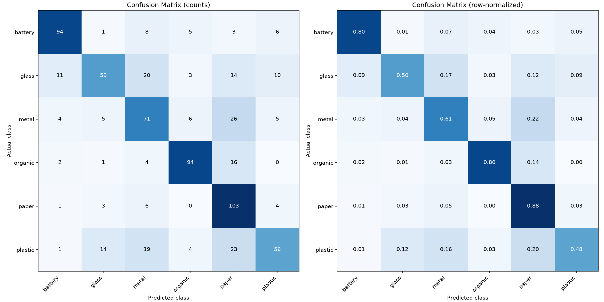
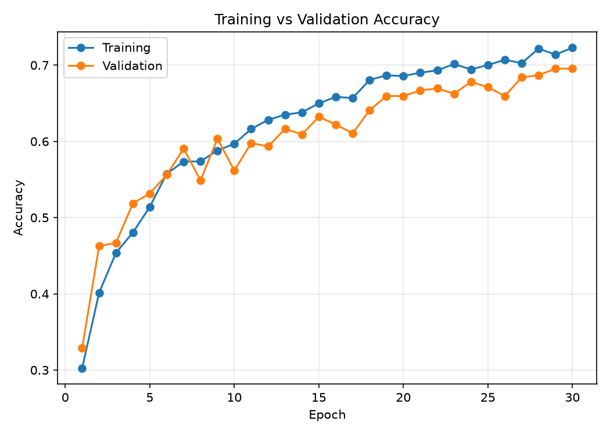

# Smart Image Classifier (WasteWealth MobileNetV2)

A TensorFlow/Keras application for classifying **waste photos** into 12 material categories using the **WasteWealth MobileNetV2** architecture, with a Streamlit upload interface and a command-line prediction tool.

**Categories (12):** `battery` · `biological` · `brown-glass` · `cardboard` · `clothes` · `green-glass` · `metal` · `paper` · `plastic` · `shoes` · `trash` · `white-glass`

> This is a waste classifier, not a general object recognizer. Cars, people, animals, toys, and screenshots are outside its intended use. The model always chooses among its 12 categories and can be confidently wrong on unrelated photos.

## Features

- Included trained CNN: run predictions without downloading a dataset or retraining.
- Streamlit image preview, top-three predictions, confidence warning, and probability chart.
- Batch command-line inference with optional JSON export and explicit failure reporting.
- JPEG/JFIF, PNG, WebP, BMP, and TIFF photo uploads; EXIF orientation and RGB conversion.
- Training, dataset analysis, test evaluation, confusion matrices, and error-analysis scripts.
- Regression tests covering image decoding, preprocessing, model inference, and error handling.

## Quick start

Use **Python 3.11** for the documented verification environment. Run commands from the repository root.

On Windows, use a short checkout/environment path (for example, `C:\src\smart-image-classifier`). TensorFlow contains deeply nested files that can exceed Windows path limits in a long directory name.

```sh
git clone https://github.com/Abhishek-dev06/smart-image-classifier.git
cd smart-image-classifier
python -m venv .venv
```

Activate the environment on Windows PowerShell:

```powershell
.\.venv\Scripts\Activate.ps1
```

Or on Linux/macOS:

```sh
source .venv/bin/activate
```

Install dependencies and launch the app:

```sh
python -m pip install --upgrade pip
python -m pip install -r requirements.txt
python -m streamlit run app.py
```

Open the local address printed by Streamlit, normally `http://localhost:8501`. Upload a clear photo of one waste item. The application accepts files up to **10 MB** and rejects unreadable or excessively large decoded images. For transparent images, inference uses a white background. Predictions run in the Python process; no external inference API or API key is required.

If PowerShell activation is unavailable, invoke `.\.venv\Scripts\python.exe` directly in place of `python`.

## REST API Server

Run the REST API server to open an API link for integrating with web, mobile (Flutter, React, Android, iOS), or microservices:

```sh
python api.py
```

- **API Base URL & Interactive Web Tester**: [http://localhost:5000/](http://localhost:5000/)
- **Health Check**: `GET http://localhost:5000/api/health`
- **Class List (12 Classes)**: `GET http://localhost:5000/api/classes`
- **Model Specifications**: `GET http://localhost:5000/api/model`
- **Prediction Endpoint**: `POST http://localhost:5000/api/predict` (Supports multipart `file` upload or JSON base64)

Example cURL request:
```sh
curl -X POST -F "file=@test_images/class_car.jpg" http://localhost:5000/api/predict
```

## Command-line predictions

```sh
# Classify a photo; quote paths containing spaces.
python src/predict.py "path/to/waste-photo.jpg"

# Process all supported files in test_images/.
python src/predict.py

# Save predictions to results/unseen_predictions.json.
python src/predict.py --save

# Choose an output file without replacing the historical results.
python src/predict.py test_images/class_images.jfif --output results/my_predictions.json
```

The output includes every class probability, sorted from highest to lowest. A score below `0.60` produces a caution message. This threshold is a display heuristic; it does **not** detect unknown objects or establish calibrated confidence.

For batch runs, invalid files are reported while valid files continue processing. The command exits unsuccessfully if any input fails, including partial failures. JSON exports contain successful predictions only.

A filename such as `plastic_bottle.jpg` can provide an **unverified filename hint** for the expected class. It is not an independent ground-truth annotation. Files with no recognizable class prefix have `expected: null` and `correct: null`.

## Recorded model results

The following figures come from the committed `results/` JSON files. They describe a historical training run, not a new evaluation performed during the bug fixes. The original dataset is absent, so these scores cannot currently be reproduced from this checkout alone.

| Metric | Recorded value |
| --- | ---: |
| Dataset images | 4,650 |
| Training / validation / test | 3,252 / 696 / 702 |
| Best epoch | 30 of 30 |
| Training accuracy at best epoch | 72.29% |
| Validation accuracy at best epoch | 69.54% |
| Test accuracy | 67.95% |
| Macro precision | 0.6975 |
| Macro recall | 0.6795 |
| Macro F1 | 0.6760 |
| Model parameters | 110,534 |

| Class | Precision | Recall | F1 | Test images |
| --- | ---: | ---: | ---: | ---: |
| Battery | 0.8319 | 0.8034 | 0.8174 | 117 |
| Glass | 0.7108 | 0.5043 | 0.5900 | 117 |
| Metal | 0.5547 | 0.6068 | 0.5796 | 117 |
| Organic | 0.8393 | 0.8034 | 0.8210 | 117 |
| Paper | 0.5568 | 0.8803 | 0.6821 | 117 |
| Plastic | 0.6914 | 0.4786 | 0.5657 | 117 |

The most common recorded confusion is **metal → paper**, affecting 26 test images. Plastic has the lowest recorded F1 score.





See [evaluation metrics](results/evaluation_metrics.json), [training summary](results/training_summary.json), and [engineering decisions](decision.md) for the evidence and interpretation.

## Dataset and training

The dataset name, download URL, license, and exact selection procedure were not recorded in the original repository. These details must be supplied by the maintainer before claiming full reproducibility or redistributing the source images. No dataset source is inferred from the class names.

For a new training run, arrange labeled JPEG or PNG files like this:

```text
dataset/raw/
├── battery/
├── biological/
├── brown-glass/
├── cardboard/
├── clothes/
├── green-glass/
├── metal/
├── paper/
├── plastic/
├── shoes/
├── trash/
└── white-glass/
```

Each class needs at least 10 readable images. Dataset scripts accept `.jpg`, `.jpeg`, and `.png`. Convert other formats before training; additional upload formats are supported by Pillow at inference time, separately from Keras' training directory loader.

```sh
python src/prepare_dataset.py
python src/dataset_analysis.py
python src/data_pipeline.py
python src/train.py --epochs 30
python src/evaluate.py
python src/confusion_analysis.py
python src/error_analysis.py
python src/generate_results_section.py
```

`prepare_dataset.py` validates all classes before rebuilding the train, validation, and test directories. A successful run **replaces existing splits**. The raw dataset is retained. Splitting uses 70% training, 15% validation, and the remainder for testing, per class, with seed 42. Integer rounding explains the recorded split sizes.

Training replaces the model and class-name files in `models/` and writes updated training results. Evaluation and analysis commands replace their respective result files. Back up artifacts before starting a new experiment. Keep `image_classifier.keras`, `class_names.json`, and `model_metadata.json` from the same run, in the original label order.

Images become 224 × 224 RGB tensors. Pixel values remain in the 0–255 range before entering the model; its built-in `Rescaling(1/255)` layer normalizes them once. Training augmentation uses horizontal flips, rotation, and zoom. The default network uses the **WasteWealth MobileNetV2** backbone with global average pooling, a 128-unit dense layer, dropout, and a 12-way softmax output.

## Verification

```sh
python -m pip install -r requirements-dev.txt
python -m pytest -q
python src/predict.py --output results/local_smoke_predictions.json
```

Tests use the bundled model and generated image fixtures; they do not need the training dataset. They verify that images can be decoded and predictions are structurally valid, **not** that arbitrary photos receive correct semantic labels. The images in `test_images/` are demonstration inputs without verified waste labels and must not be used to report classifier accuracy.

See [VERIFICATION.md](VERIFICATION.md) for the tested environment, results, and remaining validation limits.

## Troubleshooting

| Symptom | Explanation / action |
| --- | --- |
| JFIF photo was skipped or could not be selected | Fixed: the CLI and uploader share the expanded inference format list. |
| Car/person/toy gets a waste label | Expected limitation of a six-class model. Upload an in-scope waste item. |
| Waste photo gets the wrong material | Historical test accuracy is 67.95%; software fixes do not improve learned weights. Inspect top predictions and collect representative labeled examples for retraining. |
| Model cannot load | Install the tested dependencies in a clean environment; verify both model files are present and from the same training run. |
| TensorFlow installation reports a missing file under a long `include/` path on Windows | Create the checkout and virtual environment under a shorter path, then retry installation. |
| Model/class count mismatch | Restore the matching model and ordered `class_names.json`; do not rename/reorder labels independently. |
| HEIC/HEIF photo cannot be uploaded | Export it as JPEG or PNG first. These formats are not supported here. |
| Dataset or test image missing during analysis | Restore the original dataset/splits. Saved metrics alone cannot recreate source photos. |
| Corrupted or oversized photo | Re-export a smaller valid image; renaming a file extension does not repair its contents. |

## Project layout

```text
smart-image-classifier/
├── app.py                    # Streamlit interface
├── models/                   # Trained model and ordered class labels
├── results/                  # Recorded metrics, plots, and prediction artifacts
├── src/                      # Dataset, training, evaluation, and inference scripts
├── test_images/              # Demonstration photos, not an accuracy benchmark
├── tests/                    # Regression and application tests
├── requirements.txt          # Runtime dependencies
├── requirements-dev.txt      # Runtime dependencies plus pytest
├── README.md
├── decision.md               # Engineering decisions and known limitations
├── DECISIONS.md              # Link retained for existing references
├── VERIFICATION.md           # Verification evidence
└── LICENSE
```

## Limitations and next steps

The model does not detect objects, segment materials, recognize arbitrary subjects, or provide reliable unknown-class rejection. Mixed-material objects and cluttered backgrounds can be ambiguous. Square resizing distorts aspect ratios, and training/inference image decoders can differ in their handling of orientation and transparency.

Next improvements should begin with documented dataset provenance, verified labels, duplicate-aware splitting, and representative waste-photo validation. Transfer learning, higher input resolution, and confidence calibration should be assessed on validation data before a fresh held-out evaluation. Class weighting is not justified by the recorded counts alone: each class has 775 images.

## License

The code is distributed under the [MIT License](LICENSE). Dataset and sample-image rights require separate provenance checks; a repository code license does not establish those rights.
